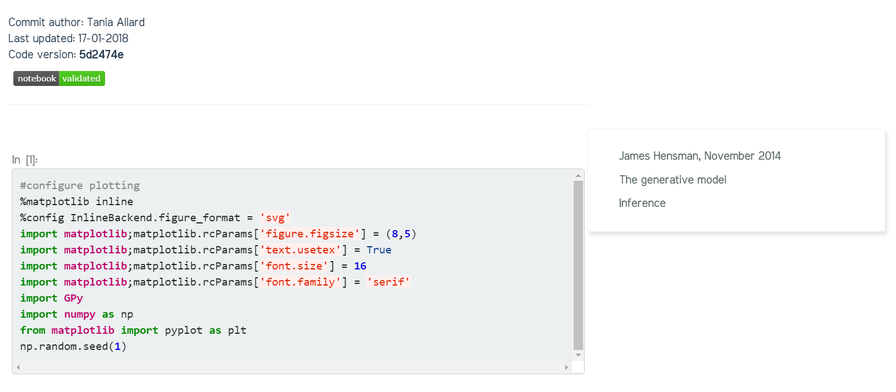
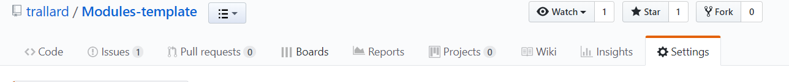
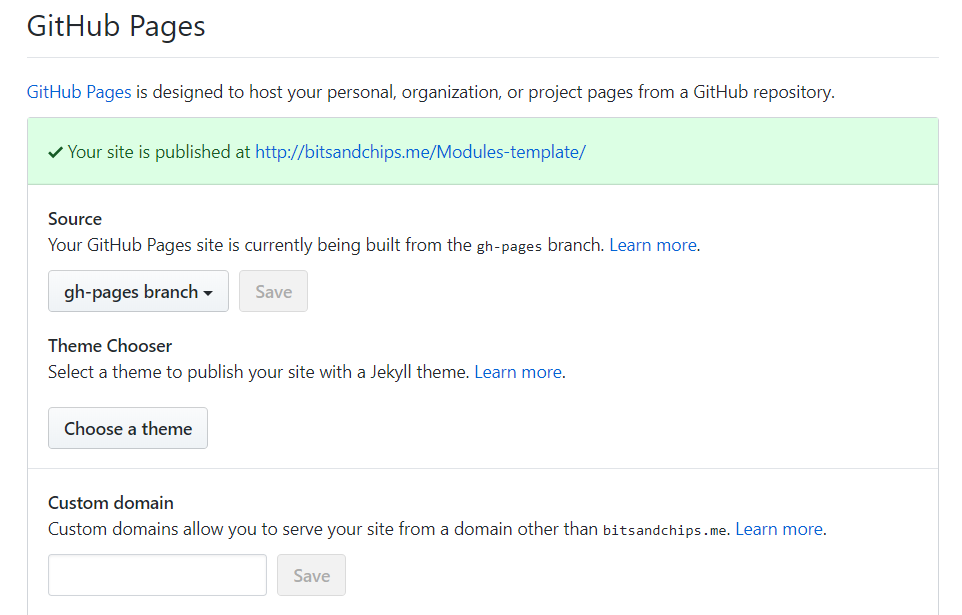

[](https://travis-ci.org/trallard/Modules-template)
[](http://www.repostatus.org/#active)

<!-- TOC depthFrom:1 depthTo:3 withLinks:1 updateOnSave:0 orderedList:0 -->

- [Modules template](#modules-template)
- [Basic Setup ✨](#basic-setup-)
	- [Configuration and setup ✨](#configuration-and-setup-)
		- [Site settings ✨](#site-settings-)
		- [Generating the pages for the lecture modules or projects ✨](#generating-the-pages-for-the-lecture-modules-or-projects-)
		- [Launching in Microsoft Azure notebooks ✨](#launching-in-microsoft-azure-notebooks-)
		- [Theme colors- Or how do I change the colour scheme?](#theme-colors-or-how-do-i-change-the-colour-scheme)
		- [Layouts](#layouts)
		- [Adding a logo and card images✨](#adding-a-logo-and-card-images)
- [Converting Jupyter notebooks to Jekyll posts ✨](#converting-jupyter-notebooks-to-jekyll-posts-)
	- [Pre-requisites](#pre-requisites)
	- [How do I do it?](#how-do-i-do-it)
	- [Do I need to commit before converting?](#do-i-need-to-commit-before-converting)
- [How to use Jekyll to build this site?](#how-to-use-jekyll-to-build-this-site)
	- [Editing pages online with GitHub](#editing-pages-online-with-github)
	- [Working locally](#working-locally)
- [Getting your website up and running ✨](#getting-your-website-up-and-running-)
	- [Where's my website?](#wheres-my-website)

<!-- /TOC -->

# Modules template
This Jekyll template is intended to be used to by academics and researchers wanting to generate a _literate programming_ and _hassle free_ static website.
This can be used as a scientific blog template or as a webpage to host/display projects information, scientific outputs or as a site for academic modules.

The live demo of this template can be found at [http://bitsandchips.me/Modules-template/](http://bitsandchips.me/Modules-template/) 💻.

**We have identified the most important configuration settings in order to get your site up and running and added a ✨ next to them.**

# Basic Setup ✨
Using this template should be relatively straightforward.  You will need to install Jekyll and **download** a copy of this repository to get started. Follow the next steps and you'll be up an running soon!

1. Install [Jekyll](https://jekyllrb.com)
2. ⬇️ Download the latest version of **Modules-template** from [https://github.com/trallard/Modules-template/releases/](https://github.com/trallard/Modules-template/releases/)
3. Unzip the contents
4. Edit your `_config.yml` to personalize your site (full instructions in [Configuration and setup](#configuration-and-setup))
5. Replace the contents of the site (posts, notebooks) with your own contents 📃
6. Push to GitHub
7. See your website live!

## Configuration and setup ✨
The main configuration for the Jekyll website is declared in the `config.yml` file. Such a file contains the site specific variables, which are accessed at various points within the website.

### Site settings ✨

```yaml
# Site settings
title: Module template
description: Lorem ipsum dolor sit amet understanding yourself in the universe tempor incididunt ut labore et dolore magna aliqua. Ut enim ad minim veniam, quis nostrud exercitation ullamco laboris nisi ut aliquip ex ea commodo consequat.
baseurl: "/Module_template"
url: "" # the base hostname & protocol for your site
```

These are the basic configuration setups for the site, this **must** be set accordingly.

The title and description are used in the landing page as well as to generate canonical urls for the website.

The variable
`baseurl` is the name of your repository which is **/Module_template** by default. If you setup your instance using another method than forking like duplication/mirroring, or you changed the name of your repository, you will need to change this accordingly.


If you have trouble understanding what the `baseurl` and `url` variables are visit <https://byparker.com/blog/2014/clearing-up-confusion-around-baseurl/>.

### Generating the pages for the lecture modules or projects ✨

Each of your lecture modules/projects should be declared as a collection in the `_config.yml` file so that Jekyll knows where to read:
~~~ yaml
collections:
  - module1
    output: true
  - module2
    output: true
~~~
(leaving the output as `true` ensures the generation of an html page for each of the files contained in the directory)

You will then need to generate a folder for each module (using the exact same name you used in the configuration file) adding an underscore to the folder's name e.g. `_module1`

Finally, to need to make sure there is a`.md` file that will serve as the front page to the module / collection. The mandatory fields for the front matter are (examples are provided in the template):
```yaml
layout: module
title: Day 1 outline
description: This is the description for the module
```

Your modules will be automatically added to the landing page in the form of a card as well as to the main navigation menu on the website.

You can then start populating these with other .md files or jupyter notebooks.
The urls and redirects to the files within the collection folders are generated
automatically and added to the front page of each module/project.

Any additional pages (e.g. about, code of conduct, profile, resources) must be created and saved in the `_pages` directory.
Once this is done the pages will be automatically added to the sidebar menu.

### Launching in Microsoft Azure notebooks ✨
If you want to import your repository Jupyter notebooks to Microsoft Azure please modify the following badge using your own repository in the `href`. Once done this, push your repository to GitHub.

<a href="https://notebooks.azure.com/import/gh/trallard/Modules_template"></a>

You will then be able to click on the `launch azurenb` badge and automatically import the notebooks to [Microsoft Azure Notebooks](https://notebooks.azure.com). Make sure to copy your library url for the following steps.

**Note that you will need to have a Microsoft Azure Notebooks account created before importing your notebooks from this GitHub repository.**

Once you have the notebooks in a Microsoft Azure Notebooks library you can add a 'launch in Azure notebooks'
button to your notebooks within your static website.

You will need to add the url address of this library in the `_config.yml` e.g:
```
azure: "https://notebooks.azure.com/trallard/libraries/BAD-days"
```
the button will be automatically added to all the rendered notebooks.
If you do not have your notebooks in Azure notebooks only comment the line with a
`#`.

*IMPORTANT* at the moment the template only supports ONE Azure Notebooks library per website. 

### Theme colors- Or how do I change the colour scheme?
The color scheme follows [Google's material design](https://material.io/guidelines/style/color.html#color-color-palette) style and is specified in terms of a primary and a secondary color, which can be modified in the `basic_style.scss` file in the root directory.

If you want to modify the color scheme or the fonts used you only need to modify this file and they will be automatically updated as the site is built.

 Alternatively, a guide for the MDB colour aliases can be found [here](https://mdbootstrap.com/css/colors/).

 Note that depending on color scheme you use for your website you might need to change the color of some components to ensure appropriate contrast and readability.

### Layouts
This template includes basic layouts for posts, pages, and presentations intended for the casual user.
Advanced layouts are included for the coding scientist providing a robust publication framework.

All of your content **must** have a Title and a layout. The rest of the variables are optional.

In the case of pages generated using the module template, the title variable will be displayed the landing page as a short description of the lecture module/project (stored in the description variable).


### Adding a logo and card images✨
If you need to add a logo to your website you can do it by saving the image to the 'images' folder and modify the name of the image in the `config.yml` file:
```yaml
logo: "./images/logo-sheffield.png"
```
similarly, if you want all the landing page cards to display the same image change the path accordingly in the `_config.yml` file
```yaml
card_image: "./images/dna.jpg"
```
otherwise you will have to specify an image on the module file yaml frontmatter e.g.
```yaml
layout: module
title: Day 1 outline
category: module
description: This is the description for the module
featured: ./images/dna2.jpg
```

# Converting Jupyter notebooks to Jekyll posts ✨
You can convert your notebooks locally into a Jekyll compliant post using the [nbjekyll](https://github.com/trallard/nbjekyll) package.

## Pre-requisites
- Python > 3.5
- nbjekyll (install using `pip install nbjekyll`)

## How do I do it?
1. Add your Jupyter notebook to the corresponding collection (e.g. `_Day1`)
2. Commit the notebook to Git
```bash
git add Tutorial.ipynb
git commit -m Add Tutorial
```
3. From the command line use nbjekyll to convert your notebooks
```bash
python -m nbjekyll.convert_nbs
```

If everything goes ok you should see a new `.md` file with the same title of your notebook and the output images in `./images/notebook_images/`.

Your newly converted notebooks will look something like this:



## Do I need to commit before converting?

**Yes**.

As you can see in the image above, the rendered notebook shows the following information;
- The code version (sha1 for the latest version, or Git commit)
- When it was last updated and by whom
- Badge indicating validation: this is done using *nbval* and tells you if your notebook is broken or can be used

If your notebooks are not committed to your version control system nbjekyll will not be able to convert and add the super nice and informative heading!

# How to use Jekyll to build this site?

## Editing pages online with GitHub

You can edit any page by following the "Edit this page" link in the Quick links nav bar. Alternatively, you can directly navigate to the corresponding .md (Markdown) file in GitHub.

This will drop you in GitHub's file editing interface, where you can modify the source code, preview it, and save your changes, by giving a short description of what you modified. If you have write access to the repository (hint: you do), your modifications will be published right-away. If you do not have right access, you will be asked to fork the repository and make a pull request.

Most of the pages are written in Markdown, which is a textual format for generating formatted text. Markdown syntax is very intuitive, you can get a quick review here or here.

CAVEATS: The Markdown engine used by this site is Kramdown. Its syntax definitions are slightly different form GitHub Flavored Markdown, thus the preview feature in GitHub might not render source as in the final result.

Other reasons why GitHub's preview may not correspond to the final results are:

- Use of Liquid templates in the source. This is seldom used, but some pages use them to access site-wide configuration variables.
- Use of special purpose markup, HTML, and scripts, such as mathematical excerpts written in MathJax.


## Working locally

If you want to do more than the occasional editing, you'll soon
realise GitHub's editor and preview are too limited. It's better to
work locally on your computer.

All you need to work locally is a [Git client](http://git-scm.com/).
[Clone the repository](https://help.github.com/articles/fork-a-repo/#step-2-create-a-local-clone-of-your-fork)
and start coding right away.

At some point, you will need to preview your work, but pushing to
GitHub each time you want to preview is clumsy.  😕
Your best option is to
[install Jekyll and the required dependencies](https://help.github.com/articles/using-jekyll-with-pages/#installing-jekyll)
on your machine. It is recommended to install the
[GitHub pages gem](https://github.com/github/pages-gem) which provides
you with the exact same versions used by GitHub to compile your site. By not doing so you might risk your website not building properly when being pushed to your GitHub repository.

If you already have Ruby, the install part should be as easy as

~~~
gem install github-pages -V
~~~

Note that you will need Ruby headers (`ruby-dev` package on Ubuntu) in
order to compile C dependencies.

On OS X, you can just type `sudo gem install github-pages -V`.

Now you can `cd` into your local clone of the repository and launch
the compilation by

~~~
jekyll serve -w -b
~~~

Your site will be generated in a `_site` sub-directory, and served
live at <http://localhost:4000/>. Any changes to the sources will
trigger an automatic recompilation!

# Getting your website up and running ✨

Once you are happy with your website content locally you can push it directly to GitHub.

You will then have to go to your GitHub repository settings at https://github.com/<your repo> and click on the settings tab:


Scroll down to the GitHub pages section and select as source the branch you'd want to deploy your site from.

Normally you'd want to use `master` if this is your only site or a personal site. Otherwise you should be using the `gh-pages` branch (e.g. if you have multiple sites for different projects). (You might need to create a gh-pages branch before if you'd not done it already).



Click Save.

## Where's my website?
You should have gotten a legend indicating the URL to which your site has been published when you activated GitHub pages (see above). You can now follow this link to hyour brand new site.
